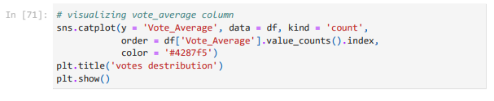
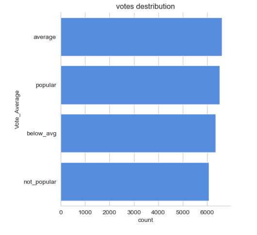
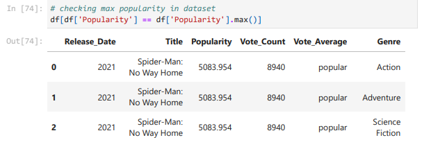
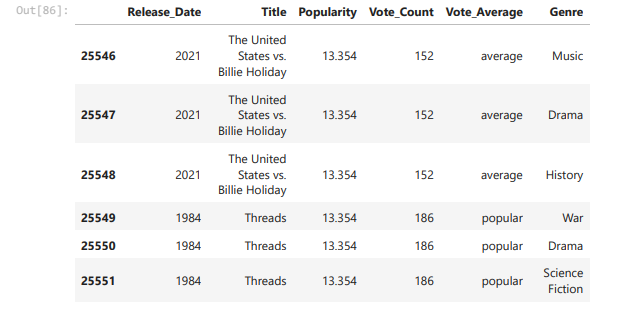
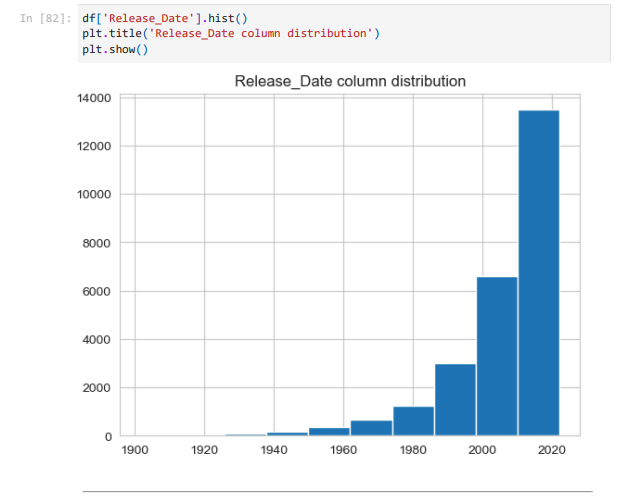

# Netflix-Data-Analysis

Netflix is known for its work in data science, AI, and ML, particularly for building strong recommendation models and algorithms that understand customer behavior and patterns. Suppose I am working in a data-driven job role, and we have a dataset of more than 9,000 movies. I need to solve the following questions to help the company make informed business decisions accordingly.

Q.) What is the most frequent genre of movies released on Netflix?

we can notice from the above visual that Drama genre is the most frequent genre
in our dataset and has appeared more than 14% of the times among 19 other
genres.

Q.) Which has highest votes in vote avg column?

Q.) What movie got the highest popularity? what's its genre?

Q.) What movie got the lowest popularity? what's its genre?

Q.) Which year has the most filmmed movies?

**Conclusion**

Q1: What is the most frequent genre in the dataset?

Ans:- Drama genre is the most frequent genre in our dataset and has appeared more than
14% of the times among 19 other genres.

Q2: What genres has highest votes ?

Ans:- We have 25.5% of our dataset with popular vote (6520 rows). Drama again gets the
highest popularity among fans by being having more than 18.5% of movies popularities.

Q3: What movie got the highest popularity ? what's its genre ?

Ans:- Spider-Man: No Way Home has the highest popularity rate in our dataset and it has
genres of Action , Adventure and Sience Fiction .

Q3: What movie got the lowest popularity ? what's its genre ?

Ans:- The united states, thread' has the highest lowest rate in our dataset
and it has genres of music , drama , 'war', 'sci-fi' and history`.

Q4: Which year has the most filmmed movies?

Ans:-year 2020 has the highest filmming rate in our dataset.

