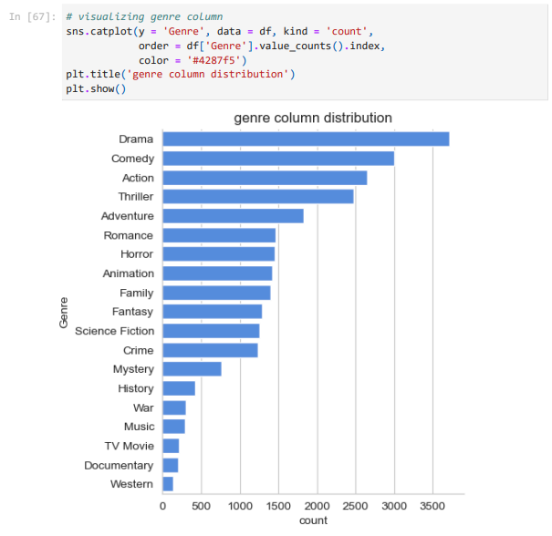

# Netflix-Data-Analysis

Netflix is known for its work in data science, AI, and ML, particularly for building strong recommendation models and algorithms that understand customer behavior and patterns. Suppose I am working in a data-driven job role, and we have a dataset of more than 9,000 movies. I need to solve the following questions to help the company make informed business decisions accordingly.

Q.) What is the most frequent genre of movies released on Netflix?

we can notice from the above visual that Drama genre is the most frequent genre
in our dataset and has appeared more than 14% of the times among 19 other
genres.

Q.) Which has highest votes in vote avg column?

Q.) What movie got the highest popularity? what's its genre?

Q.) What movie got the lowest popularity? what's its genre?

Q.) Which year has the most filmmed movies?

